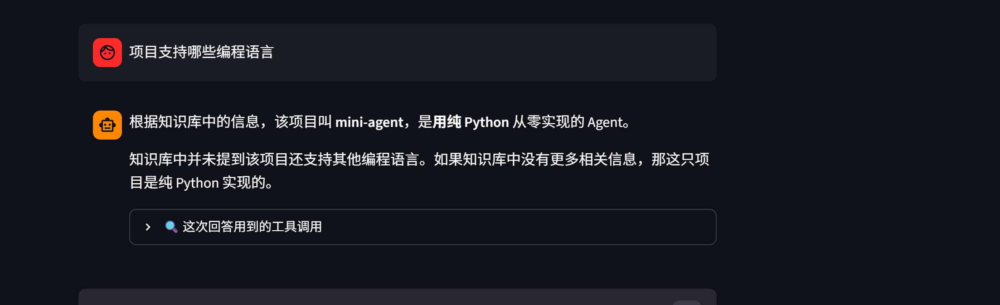

# mini-agent 知识库助手

[](https://mini-agent-kc2exmjbmhtgcdjdjd2zksh.streamlit.app/)

一个**从零手写**的轻量级 Agent 应用：基于 ReAct 循环实现工具调用与多步推理，结合 RAG 检索增强生成，不依赖 LangChain、LlamaIndex 等重框架。

> 在线体验：https://mini-agent-kc2exmjbmhtgcdjdjd2zksh.streamlit.app/

---

## 核心能力

| 能力 | 说明 |
|------|------|
| **ReAct 循环** | 模型自主决定“思考 → 行动 → 观察 → 再思考”，直到得出答案 |
| **工具调用** | 内置 `calculate`、`get_current_time`、`search_docs` 工具，通过 JSON Schema 注册 |
| **RAG 检索** | 使用智谱 `embedding-3` 对知识库向量化，手写余弦相似度实现 top-k 检索 |
| **防幻觉约束** | system prompt 强制“仅基于检索内容回答”，资料不足时主动说明 |
| **Streamlit 部署** | 已部署至 Streamlit Cloud，支持本地 `.env` 与云端 `st.secrets` 双模式 |

---

## 技术栈

- Python 3.13
- [OpenAI Python SDK](https://github.com/openai/openai-python)（兼容 DeepSeek / 智谱 OpenAI 接口）
- DeepSeek Chat（`deepseek-chat`）
- 智谱 Embedding（`embedding-3`）
- NumPy（向量相似度计算）
- Streamlit（Web 界面与部署）
- python-dotenv（本地环境变量）

---

## 项目结构

```
mini-agent/
├── app.py              # Streamlit 主程序
├── agent_loop.py       # ReAct 循环 + 工具调用核心
├── knowledge.py        # RAG 知识库：文档、向量化、检索
├── tool_call.py        # 单次工具调用教学示例
├── rag_demo.py         # RAG 流程教学示例
├── hello_agent.py      # 首次调通 LLM 的最小示例
├── requirements.txt    # 依赖清单
├── assets/             # 截图等静态资源
└── .gitignore          # 忽略 .venv / .env / __pycache__
```

---

## 本地运行

### 1. 克隆仓库

```bash
git clone https://github.com/keqi-could/mini-agent.git
cd mini-agent
```

### 2. 创建虚拟环境并安装依赖

```bash
python -m venv .venv
source .venv/bin/activate  # Windows Git Bash: source .venv/Scripts/activate
pip install -i https://pypi.tuna.tsinghua.edu.cn/simple -r requirements.txt
```

### 3. 配置 API Key

在项目根目录创建 `.env` 文件：

```env
DEEPSEEK_API_KEY=你的_DeepSeek_Key
ZHIPU_API_KEY=你的_智谱_Key
```

### 4. 启动 Streamlit

```bash
streamlit run app.py
```

---

## 部署到 Streamlit Cloud

1.  Fork / 使用本仓库，确保代码在 GitHub 上。
2.  访问 [share.streamlit.io](https://share.streamlit.io)，用 GitHub 登录。
3.  新建 App：`keqi-could/mini-agent` → `main` 分支 → `app.py`。
4.  在 App settings → Secrets 中填入：

    ```toml
    DEEPSEEK_API_KEY = "你的_DeepSeek_Key"
    ZHIPU_API_KEY = "你的_智谱_Key"
    ```

5.  点击 Save，等待自动部署完成。

---

## 效果演示

### 正常问答：基于知识库回答“什么是 ReAct？”

模型会自动调用 `search_docs` 工具检索知识库，再基于检索结果生成答案。

### 边界测试：主动拒绝回答未提及的内容



当问及“项目支持哪些编程语言”时，知识库中未明确说明其他语言，模型不会编造，而是基于已有信息说明“这是纯 Python 实现的 Agent”。

---

## 学习路线

本项目适合作为 Agent / RAG 入门简历项目，按以下阶段递进：

1. **阶段 0**：环境准备、API Key 管理、第一个 LLM 调用
2. **阶段 1**：手写工具调用（Function Calling）
3. **阶段 2**：实现 ReAct Agent 循环
4. **阶段 3**：RAG 知识库助手（Embedding + 向量检索）
5. **阶段 4**：Streamlit 界面与线上部署
6. **阶段 5**：README 与简历话术打磨

---

## 作者

- GitHub：[@keqi-could](https://github.com/keqi-could)
- 在线 Demo：https://mini-agent-kc2exmjbmhtgcdjdjd2zksh.streamlit.app/
